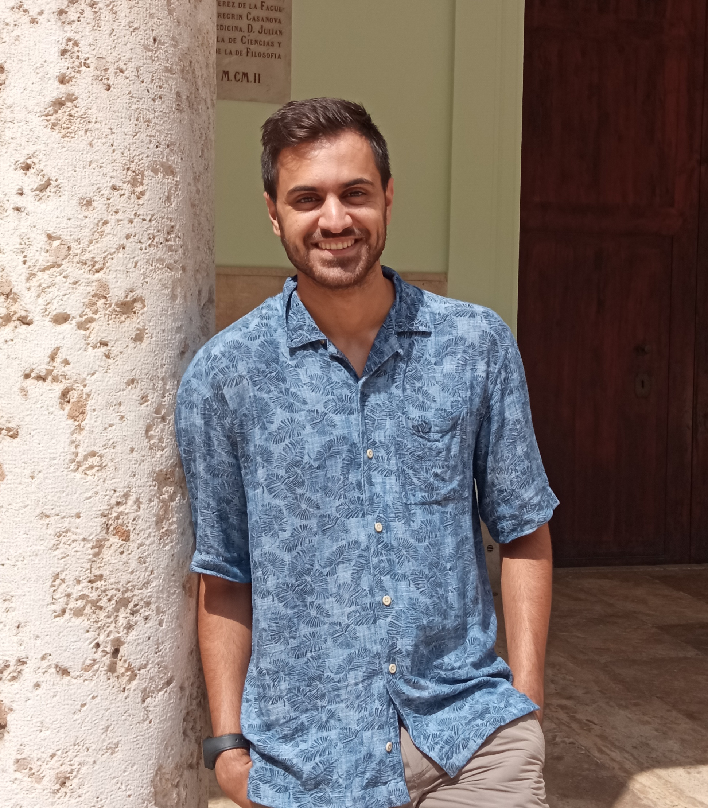

---
# Feel free to add content and custom Front Matter to this file.
# To modify the layout, see https://jekyllrb.com/docs/themes/#overriding-theme-defaults

layout: home

title: "Alberto Torralba"
subtitle: Observational extragalactic astrophysics
share-title: "Alberto Torralba - Home"
share-description: "Astronomer. Post-doctoral researcher in Observational Extragalaxtic Astrophysics."
support-promo-box: true
cover-img:
    - "assets/images/COLA1_bubbles.jpg"
---

# About me

Hi! I’m **Alberto Torralba Torregrosa**, a postdoctoral researcher at the Institute of Science and Technology Austria (ISTA). Originally from Valencia, Spain, I completed my Bachelor's, Master’s, and PhD in Physics at the Universitat de València. My research focuses on observational extragalactic astrophysics, with an emphasis on young, star-forming galaxies and active galactic nuclei (AGN) from the cosmic dawn to cosmic noon.

Outside of science, I’m passionate about movies and love going to the cinema whenever I can. In my free time, I also play electric guitar and bass.

## Connect with Me

- 📧 [alberto.torralba@ist.ac.at](mailto:alberto.torralba@ist.ac.at)
- [ 0000-0001-5586-6950](https://orcid.org/0000-0001-5586-6950)
- 𝕏 [@ATorralbaT](https://x.com/ATorralbaT)
- [ totoal](https://github.com/totoal)

---
